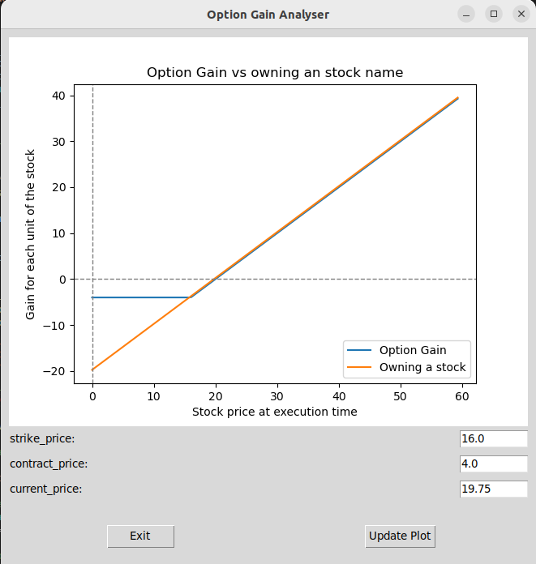

# Option Contract Analyzer
Visualizes option contract vs owning stock gains agains each other.

# Prerequiements 

```sh
python3.10 -m venv venv
source venv/bin/activate        # macOS/Linux
pip install -r requirements.txt
```

# How to use

```sh
python option_analyzer.py
```

# GUI

